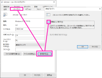

# What's this?

Windows batch (.bat) file that executs `dir /b /s /on > xxx.txt`  

# Install

Place the dir.bat file where you want to execute `dir` command.  

Note:  
If you got message `Access is denied.` when you executed dir.bat on command prompt, Create the shortcut file of dir.bat and check `Run as administrator` and use that shortcut.

  
